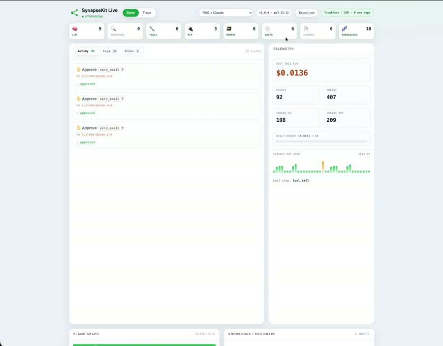

<div align="center">
  
</div>

<div align="center">

[](https://pypi.org/project/synapsekit/)
[](https://www.python.org/)
[](LICENSE)
[]()
[](https://pypistats.org/packages/synapsekit)
[](https://pepy.tech/projects/synapsekit)
[](https://synapse-kit.com)
[](https://synapsekit.github.io/synapsekit-docs/)
[](https://discord.gg/PSuAXHRywJ)

**[Website](https://synapse-kit.com) · [Documentation](https://synapsekit.github.io/synapsekit-docs/) · [Quickstart](https://synapsekit.github.io/synapsekit-docs/docs/getting-started/quickstart) · [API Reference](https://synapsekit.github.io/synapsekit-docs/docs/api/llm) · [Changelog](CHANGELOG.md) · [Discord](https://discord.gg/PSuAXHRywJ) · [Report a Bug](https://github.com/SynapseKit/SynapseKit/issues/new?template=bug_report.yml)**

</div>

---

**Build production LLM apps with 2 dependencies.**
Async-native RAG, agents, and graph workflows. No magic, no SaaS, no bloat.

> *"LangChain for people who hate LangChain."*

SynapseKit is a minimal, async-first Python framework for LLM applications: 46 LLM providers, 32 vector stores, 83 data loaders, 56 agent tools, and a dedicated embeddings/reranker layer. Every abstraction is plain Python you can read, debug, and extend. No hidden chains, no global state, no lock-in.

---

<div align="center">

### 🎬 See it live

<a href="https://synapsekit.github.io/media/">
  
</a>

**[▶ Play the demo](https://synapsekit.github.io/media/)** &nbsp;·&nbsp; watch every LLM call, tool, retrieval, DB write, knowledge-graph update, cost, and human approval stream live.

*SynapseKit Live: a zero-dependency, real-time dashboard built into the framework.*

</div>

**Run the live dashboard locally.** Three ways, no extra dependencies (it uses only the Python standard library):

```bash
# 1. Zero-touch: set one env var and run your program as usual.
#    The dashboard auto-starts on the first agent/RAG/graph call and opens your browser.
SYNAPSEKIT_LIVE=1 python your_agent.py

# 2. From the CLI: start it, then run your code in another shell.
synapsekit ui --live            # serves http://127.0.0.1:7900

# 3. From code.
python -c "from synapsekit.live import enable; enable()"   # opens the tab; keep the process alive
```

Or try a ready-made demo that exercises everything (loader → embeddings → retrieval → tools/MCP → memory/DB → knowledge graph → LLM, with logs, a flame graph, and a human approval):

```bash
python examples/live_showcase.py          # set ANTHROPIC_API_KEY first for real Claude calls
```

It opens **http://127.0.0.1:7900** and stays live while your process runs. Bound to `localhost`, token-gated, and a no-op when the env var isn't set (zero overhead in production).

---

<div align="center">

<table>
<tr>
<td align="center" width="33%">
<h3>⚡ Async-native</h3>
Every API is <code>async/await</code> first.<br/>Sync wrappers for scripts and notebooks.<br/>No event loop surprises.
</td>
<td align="center" width="33%">
<h3>🌊 Streaming-first</h3>
Token-level streaming is the default,<br/>not an afterthought.<br/>Works across all providers.
</td>
<td align="center" width="33%">
<h3>🪶 Minimal footprint</h3>
2 hard dependencies: <code>numpy</code> + <code>rank-bm25</code>.<br/>Everything else is optional.<br/>Install only what you use.
</td>
</tr>
<tr>
<td align="center" width="33%">
<h3>🔌 One interface</h3>
46 LLM providers and 32 vector stores<br/>behind the same API.<br/>Swap without rewriting.
</td>
<td align="center" width="33%">
<h3>🧩 Composable</h3>
RAG pipelines, agents, and graph nodes<br/>are interchangeable.<br/>Wrap anything as anything.
</td>
<td align="center" width="33%">
<h3>🔍 Transparent</h3>
No hidden chains.<br/>Every step is plain Python<br/>you can read and override.
</td>
</tr>
</table>

</div>

---

## 10-Line Agent Example

```python
from synapsekit import agent, tool

@tool
def get_weather(city: str) -> str:
    """Get current weather for a city."""
    return f"Sunny, 22°C in {city}"

my_agent = agent(
    model="gpt-4o-mini",
    api_key="sk-...",
    tools=[get_weather],
)

print(my_agent.run("What's the weather in Tokyo?"))
```

---

## SynapseKit vs LangChain vs LlamaIndex

<div align="center">

| | SynapseKit | LangChain | LlamaIndex |
|---|---|---|---|
| Hard dependencies | **2** | 50+ | 20+ |
| Install size | **~5 MB** | ~200 MB+ | ~100 MB+ |
| Async-native | **✅ Default** | ⚠️ Partial | ⚠️ Partial |
| Streaming | **✅ Default** | ⚠️ Varies | ⚠️ Varies |
| Cost tracking | **✅ Built-in** | ❌ LangSmith (SaaS) | ❌ No |
| Evaluation / EvalCI | **✅ CLI + GitHub Action** | ❌ LangSmith (SaaS) | ⚠️ Built-in |
| Graph workflows | **✅ Built-in** | ⚠️ LangGraph (separate pkg) | ❌ No |
| Agent federation | **✅ Built-in** | ❌ No | ❌ No |
| Reasoning LLMs | **✅ Unified adapter** | ⚠️ Manual | ⚠️ Manual |
| Structured output | **✅ Provider-agnostic** | ⚠️ Provider-specific | ⚠️ Provider-specific |
| Agent memory backends | **✅ 10 built-in** | ⚠️ Community plugins | ⚠️ Community plugins |
| Observability | **✅ Prometheus + Grafana** | ❌ No | ❌ No |
| Verifiable audit trails | **✅ Signed, hash-chained** | ❌ No | ❌ No |
| Type safety | **✅ Strict dataclasses** | ⚠️ Partial | ⚠️ Partial |
| LLM providers | **46** | 38+ | 20+ |
| Stack traces | **Your code** | Framework internals | Framework internals |
| License | **Apache 2.0** | MIT | MIT |

</div>

LangChain has more raw integrations and more tutorials. SynapseKit optimizes for a different problem: shipping, debugging, and maintaining an LLM feature in production, where readable code, predictable async behavior, and no surprise SaaS bills actually matter.

---

## What's New

The 2.x line is about trust and autonomy in production: provable agent behavior, self-managing memory, richer retrieval, local-first operation, and policy enforcement at the LLM boundary.

**Trust and verification**
- [Verifiable Agents](https://synapsekit.github.io/synapsekit-docs/docs/audit/): signed, hash-chained audit trails (Ed25519, pluggable KMS/BYOK) with a standalone verifier (`MATCH` / `DRIFT` / `UNVERIFIABLE`)
- [Guardrails](CHANGELOG.md): policy middleware for any `BaseLLM`, block/redact/flag/require-human modes, prompt-injection and jailbreak guards, PII redaction, HIPAA/GDPR/PCI-DSS rulepacks, signed audit trail
- [NeuroSymbolicAgent](https://synapsekit.github.io/synapsekit-docs/docs/agents/neuro-symbolic): LLM-proposed constraints checked by Z3, SymPy, MiniZinc, or Prolog
- Orchestration Eval: detects handoff loops, per-transfer context loss, and non-deterministic mis-routing across multi-agent runs

**Memory and retrieval**
- [Living Memory](https://synapsekit.github.io/synapsekit-docs/docs/memory/living-memory): agents propose signed, diffable memory patches instead of overwriting files
- [Property Graph RAG](https://synapsekit.github.io/synapsekit-docs/docs/rag/property-graph) and [WorldModelRAG](https://synapsekit.github.io/synapsekit-docs/docs/rag/world-model): vector search fused with graph traversal and temporal, causal knowledge graphs
- [Personal Knowledge Mesh](https://synapsekit.github.io/synapsekit-docs/docs/mesh/): local-first incremental indexing across your machine, with a `synapsekit mesh` CLI and MCP tools
- A dedicated embeddings and reranker provider layer (9 hosted providers), cloud persistence backends for agent memory and graph checkpoints

**Agents**
- [AgentSwarm](https://synapsekit.github.io/synapsekit-docs/docs/agents/swarm): market-based routing (sealed-bid, Vickrey, English, coalition auctions) with reputation learning
- [SelfImprovingAgent](https://synapsekit.github.io/synapsekit-docs/docs/agents/self-improving): eval-gated config evolution with signed patches and canary rollout
- [EdgeRuntime](https://synapsekit.github.io/synapsekit-docs/docs/edge/): local-first inference with policy-gated cloud fallback and on-device PII redaction
- Hive Mode, Agent OS Shell, Dream Mode, Ambient daemon, and a Code Archaeology agent for local, autonomous, and history-aware agent workflows

**Operations**
- [SynapseKit Live](https://synapsekit.github.io/synapsekit-docs/docs/observability/live): a zero-dependency real-time dashboard for every LLM call, tool, retrieval, and cost
- [Official Docker images on GHCR](https://synapsekit.github.io/synapsekit-docs/docs/getting-started/docker), a CAG/RAG router with a llama.cpp KV-cache backend, and a sandboxed PC Twin for safe automation

Full history in [CHANGELOG.md](CHANGELOG.md). Upgrading from 1.x? See the [Migrating to 2.0 guide](https://synapsekit.github.io/synapsekit-docs/docs/getting-started/migration-2.0).

```bash
pip install --upgrade synapsekit
```

---

## Computer Use

`ComputerUseAgent` lets a model work through a screen provider instead of an API. It observes the current screen, asks a provider for one normalized action, applies a `SafetyPolicy`, executes the action, and records a replayable session log.

```python
from synapsekit import (
    AnthropicComputerUseProvider,
    BrowserScreenProvider,
    ComputerUseAgent,
    SafetyPolicy,
)

agent = ComputerUseAgent(
    provider=AnthropicComputerUseProvider(client=anthropic_client, model="claude-3-5-sonnet"),
    screen=BrowserScreenProvider(headless=True, allowed_domains=["example.com"]),
    safety=SafetyPolicy(
        confirm_before=["delete", "send", "purchase", "navigate_to_new_domain"],
        forbidden_apps=["keychain", "1password"],
        record_session=True,
    ),
    recorder="runs/computer-use-session.jsonl",
)

result = await agent.run("Open the legacy form, enter the invoice total, and stop.")
```

Install with `pip install "synapsekit[computer-use]"`. Read [Computer Use Safety](docs/computer-use-safety.md) before running this against real desktops, browsers, credentials, or production systems.

---

## Who is it for?

SynapseKit is for Python developers who want to ship LLM features without fighting their framework.

- **Burned LangChain users**: hit a wall with debugging, dependency hell, or version churn and want full control back
- **Async backend engineers**: building FastAPI services where LangChain's sync-first model feels bolted on
- **Cost-conscious teams**: startups that don't want a LangSmith subscription for basic observability
- **ML engineers**: building RAG or agent pipelines who need full control over retrieval, prompting, and tool use

---

## Core Capabilities

| | |
|---|---|
| **🗂 RAG Pipelines** | Streaming retrieval, BM25 reranking, conversation memory, token tracing, and optional visual-page retrieval for scanned PDFs and slide decks. Load from PDFs, URLs, CSVs, HTML, directories, and 83 total sources. |
| **🤖 Agents** | ReAct loop (any LLM) and native function calling (OpenAI, Anthropic, Gemini, Mistral). 56 built-in tools, fully extensible. |
| **🔀 Graph Workflows** | DAG-based async pipelines. Nodes run in waves; parallel nodes execute concurrently. Conditional routing, typed state, fan-out/fan-in, SSE streaming, human-in-the-loop, checkpointing, Mermaid export. |
| **🧠 LLM Providers** | 46 providers behind one `BaseLLM` interface, auto-detected from the model name. Swap without rewriting. |
| **🗄 Vector Stores** | 32 backends behind one `VectorStore` interface, from a zero-dependency `InMemoryVectorStore` to managed cloud services. |
| **🔎 Embeddings & Reranking** | A provider-agnostic `BaseEmbeddings` contract and `Reranker` interface across 9 hosted providers, plus lazy ColPali/ColQwen multimodal embeddings for visual-page retrieval. |
| **🧠 Reasoning LLMs** | `ReasoningLLM` unifies o1/o3, Claude thinking, Gemini thinking, DeepSeek R1, and Qwen QwQ behind one adapter with a thinking trace. |
| **⚖️ Cost-Quality Routing** | `CostQualityRouter` explores candidates then exploits the cheapest model meeting your quality bar, with an optional hard budget cap. |
| **🎯 Prompt Optimization** | `PromptOptimizer` scores prompt variants against an `@eval_case` suite and returns the best candidate. |
| **🌐 Federated Retrieval** | `FederatedRetriever` fans out to local and remote retrievers in parallel with RRF or score-fusion merging. |
| **🧠 Smart Context Manager** | Hierarchical context windows with automatic Anthropic prompt-caching tags, cutting repeated-call cost significantly. |
| **✅ Structured Output** | Wraps any LLM, validates against a Pydantic v2 model, retries on schema failure, streams via incremental JSON parsing. |
| **🕸 Agent Federation & Swarm** | Route prompts across a registry of agents by cost, capacity, or market-based bidding, with reputation tracking. |
| **🔁 Continuous Fine-Tuning** | `ContinuousTrainer` closes the loop from production feedback to a deployed fine-tuned model, with A/B routing and rollout guards. |
| **🧪 EvalCI** | GitHub Action that runs `@eval_case` suites on every PR and blocks merge on quality regression. [Marketplace](https://github.com/marketplace/actions/evalci-by-synapsekit) |
| **📊 Agent Benchmarking** | Run GAIA, SWE-bench, WebArena, and AgentBench from the CLI, or publish and pull community eval suites via `synapsekit bench`. |
| **⚡ Performance** | `orjson`, `uvloop`, `xxhash`, vectorized MMR, `__slots__` on hot paths, optional Rust extension. `pip install synapsekit[performance]`. |

### ReasoningAgent (automatic routing)

```python
from synapsekit import ReasoningAgent, ReasoningAgentConfig
from synapsekit.agents.tools import CalculatorTool
from synapsekit.llm import LLMConfig, OpenAILLM, ReasoningLLM

agent = ReasoningAgent(
    ReasoningAgentConfig(
        fast_llm=OpenAILLM(LLMConfig(model="gpt-4o-mini", api_key="sk-...", provider="openai")),
        reasoning_llm=ReasoningLLM(model="o3", api_key="sk-..."),
        tools=[CalculatorTool()],
        agent_type="function_calling",
    )
)

answer = await agent.run("Solve: find the eigenvalues of [[2,1],[1,2]]")
```

Routes simple requests to the fast model and escalates to the reasoning model only when needed. Full docs: [docs/evalhub.md](docs/evalhub.md) for EvalHub, [CHANGELOG.md](CHANGELOG.md) for everything else.

---

## Integrations

<div align="center">

### One interface. 226+ integrations. Zero lock-in.

| 🧠 LLM Providers | 🗄 Vector Stores | 📂 Data Loaders | 🔧 Agent Tools | 🔎 Embeddings |
|:---:|:---:|:---:|:---:|:---:|
| **46** | **32** | **83** | **56** | **9** |

Every integration is `pip install synapsekit[name]`, nothing else. Swap providers, vector stores, or loaders without touching your application code.

</div>

> Icons use [Google Favicons](https://google.com/s2/favicons) for reliability across light and dark themes.

### 🧠 LLM Providers: 46 supported

> Every provider implements the same `BaseLLM` interface. Auto-detected from model name: `gpt-4o` → OpenAI, `claude-*` → Anthropic, `gemini-*` → Google. **Swap without rewriting.**

<details>
<summary><b>Show all 46 providers</b></summary>
<br/>

<table>
  <tr>
    <td align="center" width="90"><br/><sub><b>OpenAI</b></sub></td>
    <td align="center" width="90"><br/><sub><b>Anthropic</b></sub></td>
    <td align="center" width="90"><br/><sub><b>Gemini</b></sub></td>
    <td align="center" width="90"><br/><sub><b>Azure OpenAI</b></sub></td>
    <td align="center" width="90"><br/><sub><b>AWS Bedrock</b></sub></td>
    <td align="center" width="90"><br/><sub><b>Vertex AI</b></sub></td>
    <td align="center" width="90"><br/><sub><b>Mistral</b></sub></td>
    <td align="center" width="90"><br/><sub><b>Cohere</b></sub></td>
  </tr>
  <tr>
    <td align="center" width="90"><br/><sub><b>Groq</b></sub></td>
    <td align="center" width="90"><br/><sub><b>Hugging Face</b></sub></td>
    <td align="center" width="90"><br/><sub><b>Cloudflare</b></sub></td>
    <td align="center" width="90"><br/><sub><b>Databricks</b></sub></td>
    <td align="center" width="90"><br/><sub><b>Perplexity</b></sub></td>
    <td align="center" width="90"><br/><sub><b>Replicate</b></sub></td>
    <td align="center" width="90"><br/><sub><b>xAI (Grok)</b></sub></td>
    <td align="center" width="90"><br/><sub><b>Baidu ERNIE</b></sub></td>
  </tr>
  <tr>
    <td align="center" width="90"><br/><sub><b>DeepSeek</b></sub></td>
    <td align="center" width="90"><br/><sub><b>Ollama</b></sub></td>
    <td align="center" width="90"><br/><sub><b>Together AI</b></sub></td>
    <td align="center" width="90"><br/><sub><b>OpenRouter</b></sub></td>
    <td align="center" width="90"><br/><sub><b>Fireworks AI</b></sub></td>
    <td align="center" width="90"><br/><sub><b>Cerebras</b></sub></td>
    <td align="center" width="90"><br/><sub><b>SambaNova</b></sub></td>
    <td align="center" width="90"><br/><sub><b>NovitaAI</b></sub></td>
  </tr>
  <tr>
    <td align="center" width="90"><br/><sub><b>Writer</b></sub></td>
    <td align="center" width="90"><br/><sub><b>AI21 Labs</b></sub></td>
    <td align="center" width="90"><br/><sub><b>Aleph Alpha</b></sub></td>
    <td align="center" width="90"><br/><sub><b>Minimax</b></sub></td>
    <td align="center" width="90"><br/><sub><b>Moonshot</b></sub></td>
    <td align="center" width="90"><br/><sub><b>Zhipu</b></sub></td>
    <td align="center" width="90"><br/><sub><b>LM Studio</b></sub></td>
    <td align="center" width="90"><br/><sub><b>llama.cpp</b></sub></td>
  </tr>
  <tr>
    <td align="center" width="90"><br/><sub><b>vLLM</b></sub></td>
    <td align="center" width="90"><br/><sub><b>GPT4All</b></sub></td>
    <td align="center" width="90"><br/><sub><b>MLX</b></sub></td>
  </tr>
  <tr>
    <td align="center" width="90"><br/><sub><b>NVIDIA NIM</b></sub></td>
    <td align="center" width="90"><br/><sub><b>watsonx.ai</b></sub></td>
    <td align="center" width="90"><br/><sub><b>Cortex</b></sub></td>
    <td align="center" width="90"><br/><sub><b>DeepInfra</b></sub></td>
    <td align="center" width="90"><br/><sub><b>Nebius</b></sub></td>
    <td align="center" width="90"><br/><sub><b>Baseten</b></sub></td>
    <td align="center" width="90"><br/><sub><b>Upstage</b></sub></td>
    <td align="center" width="90"><br/><sub><b>Reka</b></sub></td>
  </tr>
  <tr>
    <td align="center" width="90"><br/><sub><b>Hyperbolic</b></sub></td>
    <td align="center" width="90"><br/><sub><b>FriendliAI</b></sub></td>
    <td align="center" width="90"><br/><sub><b>Clarifai</b></sub></td>
  </tr>
</table>

</details>

---

### 🗄 Vector Stores: 32 backends

> All implement `VectorStore` with `add()`, `search()`, `search_mmr()`, `save()`, and `load()`. Built-in `InMemoryVectorStore` needs zero extra deps. Everything else is `pip install synapsekit[name]`.

<details>
<summary><b>Show all 32 backends</b></summary>
<br/>

<table>
  <tr>
    <td align="center" width="90"><br/><sub><b>ChromaDB</b></sub></td>
    <td align="center" width="90"><br/><sub><b>FAISS</b></sub></td>
    <td align="center" width="90"><br/><sub><b>Qdrant</b></sub></td>
    <td align="center" width="90"><br/><sub><b>Pinecone</b></sub></td>
    <td align="center" width="90"><br/><sub><b>Weaviate</b></sub></td>
    <td align="center" width="90"><br/><sub><b>Milvus</b></sub></td>
    <td align="center" width="90"><br/><sub><b>LanceDB</b></sub></td>
    <td align="center" width="90"><br/><sub><b>PGVector</b></sub></td>
  </tr>
  <tr>
    <td align="center" width="90"><br/><sub><b>SQLiteVec</b></sub></td>
    <td align="center" width="90"><br/><sub><b>MongoDB Atlas</b></sub></td>
    <td align="center" width="90"><br/><sub><b>Redis</b></sub></td>
    <td align="center" width="90"><br/><sub><b>Elasticsearch</b></sub></td>
    <td align="center" width="90"><br/><sub><b>OpenSearch</b></sub></td>
    <td align="center" width="90"><br/><sub><b>Supabase</b></sub></td>
    <td align="center" width="90"><br/><sub><b>Cassandra</b></sub></td>
    <td align="center" width="90"><br/><sub><b>DuckDB</b></sub></td>
  </tr>
  <tr>
    <td align="center" width="90"><br/><sub><b>ClickHouse</b></sub></td>
    <td align="center" width="90"><br/><sub><b>Marqo</b></sub></td>
    <td align="center" width="90"><br/><sub><b>Typesense</b></sub></td>
    <td align="center" width="90"><br/><sub><b>Vespa</b></sub></td>
    <td align="center" width="90"><br/><sub><b>Zilliz</b></sub></td>
  </tr>
</table>

</details>

<details>
<summary>Vector-store integration validation notes</summary>
<br/>

The issue #888 adapters use the same async contract and have provider-SDK
contract tests. Their live services require credentials or a provider-managed
endpoint, so they are intentionally not started by the default CI job:

| Backend | Live integration status |
|---|---|
| Turbopuffer | Cloud-only; set `TURBOPUFFER_API_KEY` and run against a namespace |
| Azure AI Search | Azure service; requires an endpoint, admin key, and index |
| Vertex AI Vector Search | Google Cloud service; requires project credentials and a deployed index |
| SingleStore | Managed/self-hosted SQL service; requires a customer endpoint |
| TiDB Vector | TiDB Cloud/self-hosted SQL service; requires a customer endpoint |
| Couchbase | Capella/self-hosted Search service; requires a Search Vector Index |
| SurrealDB | SurrealDB server; requires a running instance and credentials |
| Deep Lake | Local or Activeloop dataset; requires a dataset path or cloud token |
| MyScale | MyScale Cloud service; requires a service endpoint and credentials |

Use the corresponding `synapsekit[...]` extra and provider setup before running
live checks. Search-before-add and persistence-after-reconnect are covered by
provider adapters; Vertex AI additionally requires `document_store_path` because
its nearest-neighbour response returns IDs only. The local `save()`/`load()`
contract is a JSON snapshot that replays documents into the selected backend.

</details>

---

### 📂 Data Loaders: 83 sources

> All return `list[Document]` with `.text` and `.metadata`. Every loader has a sync `.load()` and async `.aload()`, with the same interface across disk, cloud, databases, and APIs.

<details>
<summary><b>Show all 83 sources</b></summary>
<br/>

**File Formats**

<table>
  <tr>
    <td align="center" width="90"><br/><sub><b>PDF</b></sub></td>
    <td align="center" width="90"><br/><sub><b>Word (DOCX)</b></sub></td>
    <td align="center" width="90"><br/><sub><b>Excel (XLSX)</b></sub></td>
    <td align="center" width="90"><br/><sub><b>PowerPoint</b></sub></td>
    <td align="center" width="90"><br/><sub><b>HTML / XML</b></sub></td>
    <td align="center" width="90"><br/><sub><b>Markdown</b></sub></td>
    <td align="center" width="90"><br/><sub><b>LaTeX</b></sub></td>
    <td align="center" width="90"><br/><sub><b>YAML / JSON</b></sub></td>
  </tr>
  <tr>
    <td align="center" width="90"><br/><sub><b>Parquet</b></sub></td>
    <td align="center" width="90"><br/><sub><b>Audio (Whisper)</b></sub></td>
    <td align="center" width="90"><br/><sub><b>Video</b></sub></td>
    <td align="center" width="90"><br/><sub><b>RSS / Sitemap</b></sub></td>
    <td align="center" width="90"><br/><sub><b>Git Repo</b></sub></td>
  </tr>
</table>

**Cloud Storage**

<table>
  <tr>
    <td align="center" width="90"><br/><sub><b>AWS S3</b></sub></td>
    <td align="center" width="90"><br/><sub><b>Google Drive</b></sub></td>
    <td align="center" width="90"><br/><sub><b>Azure Blob</b></sub></td>
    <td align="center" width="90"><br/><sub><b>OneDrive</b></sub></td>
    <td align="center" width="90"><br/><sub><b>Dropbox</b></sub></td>
    <td align="center" width="90"><br/><sub><b>Google Cloud</b></sub></td>
  </tr>
</table>

**Databases**

<table>
  <tr>
    <td align="center" width="90"><br/><sub><b>PostgreSQL</b></sub></td>
    <td align="center" width="90"><br/><sub><b>MySQL</b></sub></td>
    <td align="center" width="90"><br/><sub><b>MongoDB</b></sub></td>
    <td align="center" width="90"><br/><sub><b>DynamoDB</b></sub></td>
    <td align="center" width="90"><br/><sub><b>Elasticsearch</b></sub></td>
    <td align="center" width="90"><br/><sub><b>Redis</b></sub></td>
    <td align="center" width="90"><br/><sub><b>BigQuery</b></sub></td>
    <td align="center" width="90"><br/><sub><b>Snowflake</b></sub></td>
  </tr>
  <tr>
    <td align="center" width="90"><br/><sub><b>SQLite</b></sub></td>
    <td align="center" width="90"><br/><sub><b>Supabase</b></sub></td>
  </tr>
</table>

**APIs & Productivity**

<table>
  <tr>
    <td align="center" width="90"><br/><sub><b>GitHub</b></sub></td>
    <td align="center" width="90"><br/><sub><b>Jira</b></sub></td>
    <td align="center" width="90"><br/><sub><b>Confluence</b></sub></td>
    <td align="center" width="90"><br/><sub><b>Notion</b></sub></td>
    <td align="center" width="90"><br/><sub><b>Slack</b></sub></td>
    <td align="center" width="90"><br/><sub><b>Discord</b></sub></td>
    <td align="center" width="90"><br/><sub><b>HubSpot</b></sub></td>
    <td align="center" width="90"><br/><sub><b>Salesforce</b></sub></td>
  </tr>
  <tr>
    <td align="center" width="90"><br/><sub><b>Airtable</b></sub></td>
    <td align="center" width="90"><br/><sub><b>YouTube</b></sub></td>
    <td align="center" width="90"><br/><sub><b>Reddit</b></sub></td>
    <td align="center" width="90"><br/><sub><b>Wikipedia</b></sub></td>
    <td align="center" width="90"><br/><sub><b>Obsidian</b></sub></td>
    <td align="center" width="90"><br/><sub><b>Google Sheets</b></sub></td>
    <td align="center" width="90"><br/><sub><b>Firebase</b></sub></td>
    <td align="center" width="90"><br/><sub><b>Twilio</b></sub></td>
  </tr>
  <tr>
    <td align="center" width="90"><br/><sub><b>arXiv</b></sub></td>
    <td align="center" width="90"><br/><sub><b>PubMed</b></sub></td>
    <td align="center" width="90"><br/><sub><b>Email (IMAP)</b></sub></td>
  </tr>
</table>

</details>

---

### 🔧 Agent Tools: 56 built-in

> All implement `BaseTool` with a single async `run()`. Pass any list of tools to `ReActAgent` or `FunctionCallingAgent`. **Write your own in 5 lines.**

<details>
<summary><b>Show all 56 tools</b></summary>
<br/>

<table>
  <tr>
    <td align="center" width="90"><br/><sub><b>DuckDuckGo</b></sub></td>
    <td align="center" width="90"><br/><sub><b>Google Search</b></sub></td>
    <td align="center" width="90"><br/><sub><b>Tavily</b></sub></td>
    <td align="center" width="90"><br/><sub><b>Wolfram Alpha</b></sub></td>
    <td align="center" width="90"><br/><sub><b>Wikipedia</b></sub></td>
    <td align="center" width="90"><br/><sub><b>YouTube</b></sub></td>
    <td align="center" width="90"><br/><sub><b>arXiv</b></sub></td>
    <td align="center" width="90"><br/><sub><b>PubMed</b></sub></td>
  </tr>
  <tr>
    <td align="center" width="90"><br/><sub><b>Slack</b></sub></td>
    <td align="center" width="90"><br/><sub><b>Discord</b></sub></td>
    <td align="center" width="90"><br/><sub><b>GitHub API</b></sub></td>
    <td align="center" width="90"><br/><sub><b>Jira</b></sub></td>
    <td align="center" width="90"><br/><sub><b>Notion</b></sub></td>
    <td align="center" width="90"><br/><sub><b>Linear</b></sub></td>
    <td align="center" width="90"><br/><sub><b>Stripe</b></sub></td>
    <td align="center" width="90"><br/><sub><b>Twilio</b></sub></td>
  </tr>
  <tr>
    <td align="center" width="90"><br/><sub><b>Google Calendar</b></sub></td>
    <td align="center" width="90"><br/><sub><b>AWS Lambda</b></sub></td>
    <td align="center" width="90"><br/><sub><b>Browser (Playwright)</b></sub></td>
    <td align="center" width="90"><br/><sub><b>SQL Query</b></sub></td>
    <td align="center" width="90"><br/><sub><b>Python REPL</b></sub></td>
    <td align="center" width="90"><br/><sub><b>Shell</b></sub></td>
  </tr>
</table>

</details>

---

### 🧠 Memory & Cache Backends

<table>
  <tr>
    <td align="center" width="90"><br/><sub><b>SQLite</b></sub></td>
    <td align="center" width="90"><br/><sub><b>Redis</b></sub></td>
    <td align="center" width="90"><br/><sub><b>PostgreSQL</b></sub></td>
    <td align="center" width="90"><br/><sub><b>DynamoDB</b></sub></td>
    <td align="center" width="90"><br/><sub><b>Memcached</b></sub></td>
  </tr>
</table>

10 backends in total, including MongoDB, Firestore, Cosmos DB, and Cassandra alongside the ones shown above. Persistent memory backend configuration and graph-checkpointer parity are documented in [`docs/memory/backends.md`](docs/memory/backends.md).

### 📡 Observability

<table>
  <tr>
    <td align="center" width="90"><br/><sub><b>OpenTelemetry</b></sub></td>
    <td align="center" width="90"><br/><sub><b>Prometheus</b></sub></td>
    <td align="center" width="90"><br/><sub><b>Grafana</b></sub></td>
  </tr>
</table>

`PrometheusMetrics` records `synapsekit_cost_usd_total`, `synapsekit_tokens_total`, and `synapsekit_latency_seconds` per model/provider. Hooks into the existing `observe` span pipeline, no code changes needed. Helm chart for a Prometheus + Grafana stack ships in `assets/helm/synapsekit-observability/`. `pip install synapsekit[observe]`.

### Multi-Hop Knowledge Graph RAG

SynapseKit provides advanced retrieval modules, including vector search and multi-hop Knowledge Graph (KG) retrieval.

**When to use which?**
- **Vector Search (Semantic):** Best for broad conceptual queries, finding similar passages, or answering questions whose answers are contained within a single chunk of text.
- **Knowledge Graph (KG):** Best for specific, multi-hop reasoning questions where the relationship spans across multiple documents (e.g., finding out who owns the parent company of a subsidiary).
- **Hybrid (Vector + KG):** Combining both strategies guarantees that you capture deep semantic context while also exploring explicitly extracted entity relationships. Initialize the `RAG` facade with `graph_store=NetworkXStore()` or `Neo4jStore(...)` to enable this out-of-the-box.

### Production RAG ROI

```python
from synapsekit import RAG, RAGEvaluator, SlackWebhookAlertSink
from synapsekit.cli.ui_server import create_app

rag = RAG(
    model="gpt-4o-mini",
    api_key="sk-...",
    evaluator=RAGEvaluator(
        judge_llm=judge_llm,  # a cheaper judge model
        sample_rate=0.1,
        alert_sinks=[SlackWebhookAlertSink(webhook_url=SLACK_WEBHOOK_URL)],
    ),
)

app = create_app(tracer=rag.tracer, rag_evaluator=rag.evaluator)
answer = await rag.ask("What changed in the release notes?")
await rag.wait_for_evaluations()

metrics = rag.tracer.summary()
print(metrics["avg_rag_benefit_to_cost"])
print(metrics["total_rag_alerts"])
```

<div align="center">

---
**Don't see your stack?**
Every integration is built the same way. Most take under an hour.
[Browse `good first issue` →](https://github.com/SynapseKit/SynapseKit/issues?q=is%3Aissue+is%3Aopen+label%3A%22good+first+issue%22) · [Contributing guide →](CONTRIBUTING.md) · [Discord →](https://discord.gg/PSuAXHRywJ)

We credit every contributor in the README and send a personal thank-you on Discord.

</div>

---

## Install

**pip**
```bash
pip install synapsekit[openai]       # OpenAI
pip install synapsekit[anthropic]    # Anthropic + prompt caching
pip install synapsekit[ollama]       # Ollama (local)
pip install synapsekit[performance]  # orjson + uvloop + xxhash (faster)
pip install synapsekit[observe]      # OpenTelemetry + Prometheus metrics
pip install synapsekit[training]     # Continuous fine-tuning pipeline
pip install synapsekit[bench]        # pytest-benchmark + ASV harness
pip install synapsekit[redis]        # Redis agent registry + memory backends
pip install synapsekit[all]          # Everything
```

**uv**
```bash
uv add synapsekit[openai]
uv add synapsekit[all]
```

**Poetry**
```bash
poetry add synapsekit[openai]
poetry add "synapsekit[all]"
```

**Docker.** Official images on GitHub Container Registry, no Python setup required:
```bash
# Core library + CLI
docker pull ghcr.io/synapsekit/synapsekit:latest
docker run --rm ghcr.io/synapsekit/synapsekit --version

# Batteries-included (all extras baked in)
docker pull ghcr.io/synapsekit/synapsekit:all

# Serve a SynapseKit app as an HTTP API (bind 0.0.0.0 inside the container)
docker run --rm -p 8000:8000 -v "$PWD:/app" -w /app \
  ghcr.io/synapsekit/synapsekit serve my_module:rag --host 0.0.0.0
```
Tags: `:latest` / `:<version>` (core) and `:all` / `:<version>-all` (all extras). A matching image is published automatically on every release.

Full installation options → [docs](https://synapsekit.github.io/synapsekit-docs/docs/getting-started/installation)

Observability guide → [docs/observability.md](docs/observability.md)

---

## Documentation

Everything you need to get started and go deep is in the docs.

| | |
|---|---|
| 🚀 [Quickstart](https://synapsekit.github.io/synapsekit-docs/docs/getting-started/quickstart) | Up and running in 5 minutes |
| 🗂 [RAG](https://synapsekit.github.io/synapsekit-docs/docs/rag/pipeline) | Pipelines, loaders, retrieval, vector stores |
| 🤖 [Agents](https://synapsekit.github.io/synapsekit-docs/docs/agents/overview) | ReAct, function calling, tools, executor |
| 🔀 [Graph Workflows](https://synapsekit.github.io/synapsekit-docs/docs/graph/overview) | DAG pipelines, conditional routing, parallel execution |
| 🧠 [LLM Providers](https://synapsekit.github.io/synapsekit-docs/docs/llms/overview) | All 46 providers + ReasoningLLM with examples |
| 🧪 [EvalCI](https://synapsekit.github.io/synapsekit-docs/docs/evalci/overview) | LLM quality gates on every PR, as a GitHub Action |
| 📖 [API Reference](https://synapsekit.github.io/synapsekit-docs/docs/api/llm) | Full class and method reference |

---

## Development

```bash
git clone https://github.com/SynapseKit/SynapseKit
cd SynapseKit
uv sync --group dev
uv run pytest tests/ -q
```

---

## Contributing

Contributions are welcome: bug reports, documentation fixes, new providers, new features.

Read [CONTRIBUTING.md](CONTRIBUTING.md) to get started. Look for issues tagged [`good first issue`](https://github.com/SynapseKit/SynapseKit/issues?q=is%3Aissue+is%3Aopen+label%3A%22good+first+issue%22) if you're new.

---

## Community

- 💬 [Discord](https://discord.gg/PSuAXHRywJ): chat, help, show and tell
- 💬 [Discussions](https://github.com/SynapseKit/SynapseKit/discussions): ask questions, share ideas
- 🧭 [Discord roles draft](DISCORD_ROLES.md): proposed roles and permissions for issue #389
- 🧭 [Discord release webhook draft](DISCORD_RELEASE_WEBHOOKS.md): automate release announcements for issue #390
- 🐛 [Bug reports](https://github.com/SynapseKit/SynapseKit/issues/new?template=bug_report.yml)
- 💡 [Feature requests](https://github.com/SynapseKit/SynapseKit/issues/new?template=feature_request.yml)
- 🔒 [Security policy](SECURITY.md)

---

## Contributors

<!-- ALL-CONTRIBUTORS-LIST:START - Do not remove or modify this section -->
<table>
  <tbody>
    <tr>
      <td align="center" valign="top" width="14.28%"><a href="https://github.com/AmitoVrito"><br /><sub><b>Nautiverse</b></sub></a><br /><a href="https://github.com/SynapseKit/SynapseKit/commits?author=AmitoVrito" title="Code">💻</a> <a href="https://github.com/SynapseKit/SynapseKit/commits?author=AmitoVrito" title="Documentation">📖</a> <a href="#maintenance-AmitoVrito" title="Maintenance">🚧</a></td>
      <td align="center" valign="top" width="14.28%"><a href="https://github.com/gordienkoas"><br /><sub><b>Gordienko Andrey</b></sub></a><br /><a href="https://github.com/SynapseKit/SynapseKit/commits?author=gordienkoas" title="Code">💻</a></td>
      <td align="center" valign="top" width="14.28%"><a href="https://github.com/Deepak8858"><br /><sub><b>Deepak singh</b></sub></a><br /><a href="https://github.com/SynapseKit/SynapseKit/commits?author=Deepak8858" title="Code">💻</a></td>
      <td align="center" valign="top" width="14.28%"><a href="https://github.com/by22Jy"><br /><sub><b>by22Jy</b></sub></a><br /><a href="https://github.com/SynapseKit/SynapseKit/commits?author=by22Jy" title="Code">💻</a></td>
      <td align="center" valign="top" width="14.28%"><a href="https://github.com/Arjunkundapur"><br /><sub><b>Arjun Kundapur</b></sub></a><br /><a href="https://github.com/SynapseKit/SynapseKit/commits?author=Arjunkundapur" title="Code">💻</a></td>
      <td align="center" valign="top" width="14.28%"><a href="https://github.com/Ashusf90"><br /><sub><b>Harshit Gupta</b></sub></a><br /><a href="https://github.com/SynapseKit/synapsekit-docs/pull/34" title="Documentation">📖</a></td>
      <td align="center" valign="top" width="14.28%"><a href="https://github.com/DhruvGarg111"><br /><sub><b>Dhruv Garg</b></sub></a><br /><a href="https://github.com/SynapseKit/SynapseKit/commits?author=DhruvGarg111" title="Code">💻</a></td>
      <td align="center" valign="top" width="14.28%"><a href="https://github.com/adaumsilva"><br /><sub><b>Adam Silva</b></sub></a><br /><a href="https://github.com/SynapseKit/SynapseKit/commits?author=adaumsilva" title="Code">💻</a></td>
      <td align="center" valign="top" width="14.28%"><a href="https://github.com/qorexdev"><br /><sub><b>qorex</b></sub></a><br /><a href="https://github.com/SynapseKit/SynapseKit/commits?author=qorexdev" title="Code">💻</a></td>
      <td align="center" valign="top" width="14.28%"><a href="https://github.com/Abhay-Mmmm"><br /><sub><b>Abhay Krishna</b></sub></a><br /><a href="https://github.com/SynapseKit/SynapseKit/commits?author=Abhay-Mmmm" title="Code">💻</a></td>
      <td align="center" valign="top" width="14.28%"><a href="https://github.com/ayushbhatt1224"><br /><sub><b>AYUSH BHATT</b></sub></a><br /><a href="https://github.com/SynapseKit/SynapseKit/commits?author=ayushbhatt1224" title="Code">💻</a></td>
      <td align="center" valign="top" width="14.28%"><a href="https://github.com/Chaturvediharsh123"><br /><sub><b>HARSH</b></sub></a><br /><a href="https://github.com/SynapseKit/SynapseKit/commits?author=Chaturvediharsh123" title="Documentation">📖</a></td>
      <td align="center" valign="top" width="14.28%"><a href="https://github.com/mikemolinet"><br /><sub><b>mikemolinet</b></sub></a><br /><a href="https://github.com/SynapseKit/SynapseKit/commits?author=mikemolinet" title="Code">💻</a> <a href="https://github.com/SynapseKit/SynapseKit/issues?q=author%3Amikemolinet" title="Bug reports">🐛</a></td>
      <td align="center" valign="top" width="14.28%"><a href="https://github.com/acorello"><br /><sub><b>Alessandro Mecca</b></sub></a><br /><a href="https://github.com/SynapseKit/SynapseKit/commits?author=acorello" title="Code">💻</a> <a href="https://github.com/SynapseKit/SynapseKit/issues?q=author%3Aacorello" title="Bug reports">🐛</a></td>
      <td align="center" valign="top" width="14.28%"><a href="https://github.com/Premvkmishra"><br /><sub><b>Prem Mishra</b></sub></a><br /><a href="https://github.com/SynapseKit/SynapseKit/commits?author=Premvkmishra" title="Code">💻</a></td>
      <td align="center" valign="top" width="14.28%"><a href="https://github.com/MohamedIdhries"><br /><sub><b>MohamedIdhries</b></sub></a><br /><a href="https://github.com/SynapseKit/SynapseKit/commits?author=MohamedIdhries" title="Code">💻</a></td>
      <td align="center" valign="top" width="14.28%"><a href="https://github.com/zaher-m"><br /><sub><b>Mahmoud Zaher</b></sub></a><br /><a href="https://github.com/SynapseKit/SynapseKit/commits?author=zaher-m" title="Code">💻</a></td>
      <td align="center" valign="top" width="14.28%"><a href="https://github.com/ramashishmaurya"><br /><sub><b>MAURYA ASHISH</b></sub></a><br /><a href="https://github.com/SynapseKit/SynapseKit/commits?author=ramashishmaurya" title="Code">💻</a></td>
    </tr>
  </tbody>
</table>
<!-- ALL-CONTRIBUTORS-LIST:END -->

---

## License

[Apache 2.0](LICENSE)
